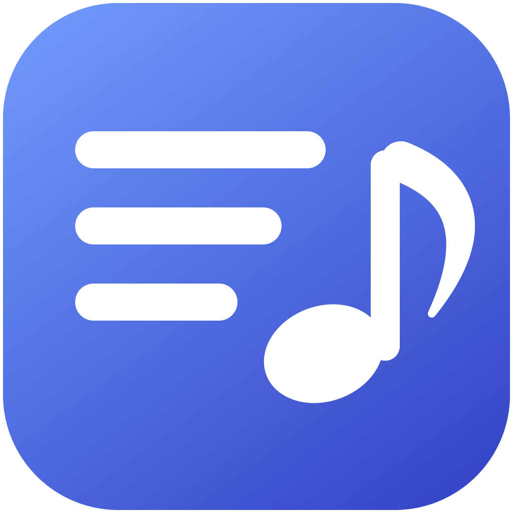

<div align="center">



# Music Library Organizer

**Bring a music collection's artist list back to the artists you actually listen to.**

Windows · macOS · works directly on an Android phone over adb

</div>

---

A player builds its artist list out of whatever is written in the tags, not out
of what you think you own. So a library of thirteen artists shows up as
fifty-eight:

| What is in the file | What the player shows |
|---|---|
| Album artist `Various Artists` | a whole compilation filed under an artist nobody listens to |
| The compilation flag (`TCMP` / `cpil` / `COMPILATION`) | the same, with no album artist involved |
| `Future, Juice Wrld, Young Thug` | a one-track artist that exists once |
| `Juice WRLD`, `juice wrld`, `JUICE WRLD` | three artists |
| `City Morgue␀Sosmula` (two values in one field) | one artist with a square in the middle of its name |

This tool reads the whole collection, shows the list as it would be, and lets
you fold it down to what you meant — then writes it back. Nothing is written
until you press **Apply**, and **Show changes** prints, file by file, what is
about to happen.

## What it does

**Artists.** Every name in the files, reduced to the artist it belongs to:
spellings of one name merged, guest credits detached from the lead, and any
artist you want put under another one by hand. The heading above the list is a
running total — *58 names in the files become 26 artists* — and opening it
shows every single fold with a tick next to it. Untick what is wrong, or type
a different artist into the heading and the ticked names go there instead.

**Tracks.** The whole library in one sortable table, the way a desktop player
shows it. Select a few rows, or a few hundred, and set artist, album artist,
album, title, genre, year, track and disc number on all of them at once. Right
click for the file itself: show it in the file manager, copy its path, select
everything by the same artist, select the rest of the album.

**Lyrics.** Finds lyrics for the tracks that have none and writes them into the
files as plain text — `USLT` in MP3, `LYRICS` in FLAC, `©lyr` in MP4.

**Cleanup.** The tags that invent artists: set the album artist from the artist
or remove it entirely, clear the compilation flag, clear the album artist sort
name, remove the obsolete tag at the end of a file.

**Artwork.** A cover saved at full resolution makes a tag of several megabytes,
and a phone's media scanner stops reading a tag at three — so the file's artist
and title never reach the player at all. Covers on those files are re-encoded
to fit within 1000 pixels, which is more than any screen shows them at: one
real file went from a 12.9 MB tag to 102 KB, and the phone started reading it.

## Formats

| Format | Tags |
|---|---|
| MP3 | ID3v2.2, ID3v2.3, ID3v2.4 — v2.2 and v2.3 are upgraded to v2.4 on write, artwork and all |
| FLAC | Vorbis comments |
| M4A / AAC / ALAC (`.m4a`, `.m4b`, `.m4p`, `.mp4`) | iTunes-style `ilst` atoms |

Files are replaced whole and atomically: the new file is written beside the old
one and swapped in, so a crash halfway through cannot leave a broken track.
The modification date is put back afterwards, so nothing re-sorts under
"recently added".

Two things in a real collection defeat a strict reader, and both are handled:

- **A tag that cannot be walked in one pass.** A large picture frame the usual
  parser stops reading half-way through leaves it looking at image data where
  the next frame header should be, and the file reads as unreadable although
  every field is still there. Those tags are read frame by frame instead, and
  written back in a form any parser can read before the file is edited.
- **The obsolete 128-byte tag at the end of a file.** Android's media database
  reads it in preference whenever the real tag is over about three megabytes —
  which one uncompressed cover exceeds on its own — so a file carrying both
  keeps showing the name it was given years ago. Every write brings that tag
  into line with the real one, or takes it off where nothing needs it. A name
  it cannot spell, such as a Cyrillic one, is never written into it in a
  mangled form: the tag goes instead.

## Working on a phone

An Android phone is not a disk. What Windows shows over MTP has no path a
program can open, and copying a 23 GB collection to the computer and back to
change a few hundred bytes per file would move all of it twice.

So the phone half runs on the phone. A small static agent travels inside the
application, is pushed to `/data/local/tmp` over adb, and reads and writes tags
in place; only the tags themselves cross the cable. The agent is identified by
the hash of its own binary, so a release that changes the tag reader always
replaces the agent that is already on the phone.

What you need:

1. **USB debugging** turned on in the phone's developer options.
2. **adb** — found automatically in `PATH`, in the Android SDK, in the winget
   install location, or in Homebrew. If it is not installed,
   [Platform Tools](https://developer.android.com/tools/releases/platform-tools)
   is the whole download.
3. The confirmation dialog on the phone, the first time.

Then pick **Android phone** instead of a folder, choose the music folder, and
work as usual. After applying, the tool asks Android to re-index the files it
changed, so players see the new tags without a reboot — and then to read the
playlists again.

That second step is not housekeeping. A playlist on Android is a list of
database row numbers, not of file names, so rewriting a track's tags gives it a
new row and every playlist that pointed at the old one silently loses the
entry. The playlist files on disk are never touched, so having the scanner read
them again puts every entry back; without it, a collection comes out of a tag
edit with its playlists gutted.

Only 64-bit ARM phones are supported, which is every Android phone still
receiving applications.

## Lyrics sources

Sources are asked in turn, and the first confident match wins:

1. **[LRCLIB](https://lrclib.net)** — open, no key, no account. Good on
   released music, and it reports the track's length, which is what rules out
   a same-titled song by somebody else.
2. **[Genius](https://genius.com)** — picks up what LRCLIB has never heard of:
   leaks, mixtapes, unreleased tracks.
3. **[lyrics.ovh](https://lyrics.ovh)** — asked last and only about what the
   other two could not place. It cannot search, only answer about a name it is
   given, so it is never allowed to answer ahead of a source that looked.

A match is scored on artist and title, allowing for the junk tags collect
(`(Official Audio)`, `[Prod. Nick Mira]`, `feat.` tails) and for how close the
durations are. An unconvincing match is thrown away: no lyrics beats somebody
else's lyrics.

Tags are wrong in two ordinary ways, and each costs one more search rather
than a guess:

- **The artist field is not an artist.** A file from a download service is
  credited to the service — `VK`, `Various Artists`, `Unknown Artist` — and the
  real name survives only in the album artist, or in the file's own name, so
  `Artist - Title.mp3` is read and searched for as well. Names are also
  compared by the words they have in common, so a file credited to `ZillaKami
  x SosMula` still matches a database entry filed under `City Morgue`.
- **The title carries a qualifier no database knows.** `Deprived (Session
  Edit)`, `Devil Horns (v1)` and `Insecurities OG` return nothing anywhere;
  searched under the plain name they are all found, and another take of the
  same song is accepted as a match.
- **The title repeats the artist**, as a download names its file: `Lil Uzi
  Vert - No Script` is searched for under `No Script`, since asking for the
  artist twice finds nothing.
- **A collaboration is filed under the guest.** `Act Right (feat. GDo)` is
  GDo's song on Genius, so a candidate credited to a guest the title names
  counts as credited to somebody who was on the track. Guests are read in
  either alphabet, including the `п.у.` a Russian release writes.

What nearly matched is named instead of being thrown away silently: a track
the databases hold under an alias comes back as *not found (closest: …)*, and
can be finished from the track menu with **Lyrics from a link…**.

A source that answers 429 or 5xx is retried twice before it counts as failed,
and a source falling over is only reported when no source answered at all —
otherwise the track was searched for properly and simply is not there.

Some tracks no search can reach: a Russian act catalogued under a
transliteration of its name, a leak credited to whoever leaked it. Right click
the track and choose **Lyrics from a link…** to paste the song's page instead;
what came back is shown before anything is staged.

Where a source has the words timed line by line, those are what goes into the
tag. Phonograph decides what to show with

```kotlin
val all = listOfNotNull(embedded) + externalPrecise + externalVague
val activated: Int = all.indexOfFirst { it is LrcLyrics }
```

— the embedded lyrics come first in that list, but nothing is shown at all
unless something in it carries timings, which is why plain words sit behind a
menu. Timed words in the same tag are picked up by themselves, and scroll with
the song.

## Building

You need [Go](https://go.dev/dl/) 1.21+ and the Wails CLI:

```
go install github.com/wailsapp/wails/v2/cmd/wails@latest
```

The interface is plain HTML, CSS and JavaScript in `frontend/dist`, so there is
no npm, no Node and no bundler step.

```
make build          # rebuilds the phone agent, then the application
```

or, without make:

```powershell
.\build.ps1
```

Both do the same two things, and the order matters — the agent is embedded into
the application, so it is built first:

```
CGO_ENABLED=0 GOOS=linux GOARCH=arm64 go build -trimpath -ldflags="-s -w" \
    -o internal/device/agent/mlm-agent-arm64 ./cmd/agent
wails build
```

**Windows** needs WebView2, which Windows 11 already has and Windows 10 takes
[from here](https://developer.microsoft.com/microsoft-edge/webview2/). The
result, `build/bin/Music Library Organizer.exe`, needs nothing else.

**macOS** needs the Xcode command line tools (`xcode-select --install`) and
produces `build/bin/Music Library Organizer.app`; `wails build -platform
darwin/universal` covers both architectures. A `.app` can only be built on a
Mac — Apple does not allow cross-compiling to its own platform.

For development, `wails dev`.

The icon is generated rather than drawn:
`go run ./tools/icon build` rewrites `build/appicon.png` and
`build/windows/icon.ico`.

## Tests

```
go test ./...
```

The tag tests build real files with **ffmpeg** and check the result with
**ffprobe**, including that an edited file still decodes without complaint;
without ffmpeg they skip themselves. Some lyrics tests go to the network —
`go test -short ./...` leaves those out.

## Worth knowing

- **Backups are off by default.** Turn them on under *Cleanup* the first time
  you edit a collection: every changed file gets a `.bak` copy beside it, which
  scanning then ignores.
- **MP3 tags are upgraded to ID3v2.4 on write.** Older versions only offer
  UTF-16 for anything but Latin-1, and the common writer for it mangles
  Cyrillic. v2.4 allows UTF-8, and every current player reads it — Phonograph,
  foobar2000, VLC, iTunes.
- **Guest credits found by a separator are not detached on their own.** `&`,
  `;`, `/` and commas turn up inside real names too, as in `Earth, Wind &
  Fire`, so those are shown ticked but visible rather than applied silently.
- **A folder can be opened from the command line**, which is also what happens
  when one is dropped onto the application:
  ```
  "Music Library Organizer.exe" "D:\Music"
  ```

## Licence

MIT. See [LICENSE](LICENSE).
